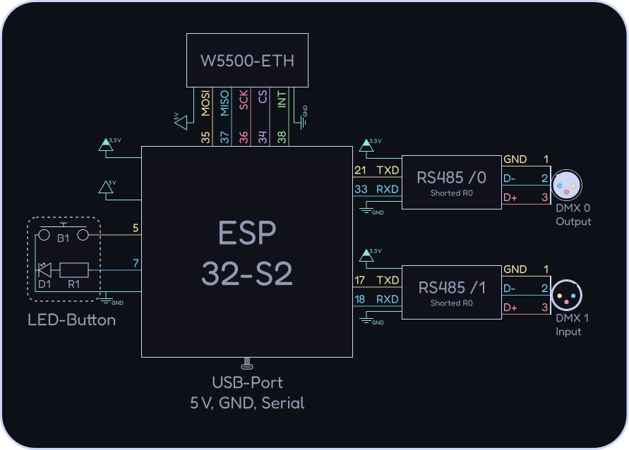

# DMX-Interface

### Project Overview: ChaosDMX

**ChaosDMX** is a 100% Open-Source, multi-protocol DIY interface that acts as a versatile bridge between lighting control software (e.g., QLC+, Freestyler, DMXControl) and physical stage equipment like fixtures, spotlights, moving heads, and fog machines. It features **two fully configurable DMX ports** that can be individually set up as either **DMX Input** or **DMX Output**.

The interface offers maximum connectivity by supporting industry-standard protocols and wireless technologies over both network and hardware interfaces:

* **Network & Wireless (Art-Net, sACN / E1.31, ESP-NOW):** Operates over a stable, wired **Ethernet** connection or wirelessly via **Wi-Fi**. It supports **Station Mode (STA)** for existing networks, **Access Point Mode (AP)** for standalone operation, and **ESP-NOW** for low-latency, direct wireless communication between devices.
* **USB:** Connects directly to a PC as a serial device, providing native plug-and-play compatibility with software like **QLC+** for sending and receiving DMX data.

> [!NOTE]
> This project is currently in a rewrite phase, we are currently switching the Framework from [Arduino](https://www.arduino.cc/) to [ESP-IDF](https://developer.espressif.com/tags/esp-idf/) and are reworking the codebase.
> The current state is not stable, but you can check out the [legacy/arduino](https://github.com/HendrikRauh/dmx-interface/tree/legacy/arduino) branch.
> Feel free to help us by [contributing](#-contributing) to the project!

______________________________________________________________________

## 🛒 Parts

| Count | Part |
| --- | --- |
| 1x | ESP32 (Lolin S2 Mini) |
| 2x | RS485 |
| 1x | W5500-ETH |
| 1x | LED-Button |
| 1x | ♂️-DMX-socket |
| 1x | ♀️-DMX-socket |

Additionally, you need:

- some wires
- soldering equipment
- 3D-printer
- small screws (see [case](#-case))
- heat shrink tubing
- hot glue gun

______________________________________________________________________

## 🔌 Wiring

> [!IMPORTANT]
> You have to short-circuit `R0` on the RS485 boards to enable the termination resistor required for DMX for the first and last devices in the chain.

Have a look at the following diagram for how to wire the components together, the table below shows the pinout of the ESP32 and how to connect them to it.



| GPIO | Usage |
| --- | --- |
| GND | GND to others |
| 3,3V | VIN on RS485 |
| 5V/VBUS | VIN on W5500 |
| 0 | Onboard Button |
| 5 | Ext. Button |
| 7 | Ext. LED |
| 15 | Onboard LED |
| 17 | U1TXD |
| 18 | U1RXD |
| 21 | U0TXD |
| 33 | U0RXD |
| 34 | SPI CS |
| 35 | SPI MOS |
| 36 | SPI SCK |
| 37 | SPI MISO |

______________________________________________________________________

## 🚀 Installation

1. Install [ESP-IDF](https://docs.espressif.com/projects/esp-idf/en/stable/esp32/get-started/index.html) (`idf.py`) on your system
2. Connect the ESP32 to your computer via USB
3. Flash the firmware by running `idf.py flash` or if you have [invoke](https://www.pyinvoke.org/) installed: `inv flash` in the project folder
4. (optional) Monitor the serial output using `idf.py monitor` or `inv monitor`

> [!TIP]
> If the ESP32 does not show up as a serial device, you might need to place it in bootloader mode.

______________________________________________________________________

## 📦 Case

All print files can be found in the folder `assets/case`.
Alternatively, you can view the current case on [OnShape](https://cad.onshape.com/documents/7363818fd18bf0cbf094790e/w/52455282b39e47fbde5d0e53/e/9bec98aa83a813dc9a4d6ab2) where you can export the files in a format of your choice.
Feel free to design your own case (and maybe address the [issues with the current one](https://github.com/HendrikRauh/dmx-interface/issues/92)) and share it with us!


In addition to the print you will need:

| Count | Part | Location |
| --- | --- | --- |
| 6x | M2x5 screw | Case lid, ESP32 |
| 2x | M2,5x5 screw | W5500 |
| 4x | M3 screw | XLR sockets |
| 4x | M3 nut | XLR sockets |

______________________________________________________________________

## 💡 Status LED

We have a status LED-Button that shows the current state of the device.

| LED | Description |
| --- | --- |
|  | no power; LED deactivated |
|  | powered on; normal |
|  | startup; warning |
|  | resetting; error |

______________________________________________________________________

## ⚙️ Config

You can configure the device by connecting to the WiFi network and accessing the web interface via the IP address configured or the default listed below.

### Default config

To reset the settings, hold down the button and connect the ESP to the power supply, the LED will flash rapidly. After 3 seconds the LED will turn solid and the settings are reset. If you release the button early, you will abort the reset and the LED will flash slowly.

| Setting | Value |
| --- | --- |
| TYPE | WiFi AP |
| SSID | ChaosDMX-□□□□ |
| PASSWORD | ChaosDMX |
| IP-Address | 192.168.4.1 |
| DMX1 (Left) | OUTPUT; Universe 1 |
| DMX2 (Right) | INPUT; Universe 2 |
| LED Brightness | 10 % |

______________________________________________________________________

## 🧑‍💻 Development

We provide a ready-to-use development environment using Nix, but you can also set up the environment manually if you prefer. If you don't want to use Nix make sure you install the required tools listed in the `buildInputs` section in `flake.nix`.
If you're on Windows we recommend using [WSL](https://learn.microsoft.com/en-us/windows/wsl/) and following the instructions below inside the WSL session.

> [!WARNING]
> Under WSL further steps are required, needs research! USB usage etc (usbipd-win)

### Setup NIX

For usage of the development environment, you need to have the nix package manager installed on your system. In addition, you need to enable flakes support by adding the following lines to your `~/.config/nix/nix.conf`:

```conf
experimental-features = nix-command flakes
```

You can do this by running the following command that installs you nix and enables flakes support:

```bash
curl -L https://nixos.org/nix/install | sh
```

### Setup direnv (optional)

In addition you can use [direnv](https://direnv.net/) to automatically enter the development environment when you navigate to the project folder. You can install it by following [the instructions on their website](https://direnv.net/docs/installation.html).

The first time, you need to allow the `.envrc` file by running `direnv allow` in the project folder.
After that, you can just navigate to the project folder and you will automatically enter the development environment.

### Commands

This project uses [invoke](https://www.pyinvoke.org/) to simplify running common commands.
Run `inv --list` to see all available tasks or have a look at the `tasks.py` file.

Here is a small selection of the most common tasks:

| Command | Description |
| --- | --- |
| `inv build` | Build the firmware using ESP-IDF |
| `inv flash` | Flash the firmware to the ESP32 |
| `inv monitor` | Monitor the serial output |
| `inv docs -o` | Generate the documentation using Doxygen and open it in your browser |

### Pre-commit hooks

This project uses [git-hooks.nix](https://github.com/cachix/git-hooks.nix) to run code quality, formatting, and consistency checks. When you use the dev-shell these run before your commit and format the code etc.
If you're not using the dev-shell don't worry, the action runner does the check on the repo again and will check it for you.

### Documentation

Further documentation including data structures and code can be found on [DMX-Interface](https://hendrikrauh.github.io/dmx-interface/).
This uses [Doxygen](https://www.doxygen.nl/) to generate the documentation from the source code, you can also generate it locally by running `inv docs` or `inv docs -o` to open it in your browser after generation.
Functions, variables, and data structures should be documented using Doxygen comments, see the [Doxygen manual](https://www.doxygen.nl/manual/docblocks.html) for more information on how to write these comments.

The documentation for your branch will be automatically generated and published under `https://hendrikrauh.github.io/dmx-interface/branch/<your-branch-name>` when you push your changes.

______________________________________________________________________

## 🤝 Contributing

Contributions, issues, and feature requests are welcome!

Feel free to check the [issues page](https://github.com/HendrikRauh/dmx-interface/issues) and the [pull requests](https://github.com/HendrikRauh/dmx-interface/pulls) on GitHub.
Thanks to all contributors who have helped make this project better!

<a href="https://github.com/HendrikRauh/dmx-interface/graphs/contributors">
    
</a>
